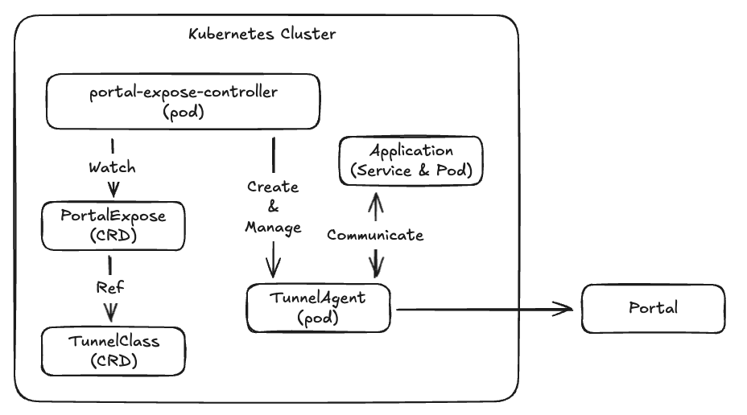

# Architecture

## Overview

Portal Expose Controller bridges Kubernetes and the Portal network, enabling you to expose cluster services to the internet through Portal's secure relay system. The controller watches custom resources and automatically manages tunnel deployments that connect your services to Portal relays.

## High-Level Architecture

## Components

### 1. Custom Resource Definitions (CRDs)

#### TunnelClass
Defines tunnel pod configuration templates. The controller manages all tunnel internals (image, encryption, timeouts) while users only specify performance tier and placement.

**Key Responsibilities:**
- Define performance tiers (small, medium, large)
- Set replica count for high availability
- Configure node placement (nodeSelector, tolerations)

#### PortalExpose
Defines how a Kubernetes service should be exposed through Portal.

**Key Responsibilities:**
- Reference a TunnelClass for tunnel configuration
- Specify target Kubernetes Service (name and port)
- Define application name (becomes subdomain)
- List Portal relay endpoints

### 2. Controllers

#### TunnelClass Controller
Watches TunnelClass resources and validates configurations.

**Responsibilities:**
- Validate size tiers (small/medium/large)
- Ensure only one default TunnelClass exists
- Store validated configuration for PortalExpose controller

#### PortalExpose Controller
The main controller that orchestrates tunnel deployments.

**Responsibilities:**
- Watch PortalExpose resources
- Resolve TunnelClass references
- Create and manage tunnel Deployments
- Validate target Services exist
- Update status with connection state and public URLs
- Clean up resources on deletion

### 3. Tunnel Pods

Tunnel pods are automatically created and managed by the controller. They establish WebSocket connections to Portal relays and forward traffic to target services.

**Characteristics:**
- Image: `ghcr.io/gosuda/portal-tunnel:latest` (controlled by controller)
- Protocol: WebSocket Secure (WSS)
- Encryption: TLS (always enabled)
- Multiple replicas supported for high availability

**Pod Configuration (Managed by Controller):**
- Container image and version
- Resource requests and limits (based on size tier)
- Security context (runAsNonRoot, capabilities dropped)
- Environment variables (relay URLs, target service)
- Health checks and readiness probes

## Related Documentation

- [Usage Guide](../README.md#usage) - How to use PortalExpose and TunnelClass
- [Examples](../examples/README.md) - Example configurations
- [Development Guide](../README.md#development) - Contributing to the project
